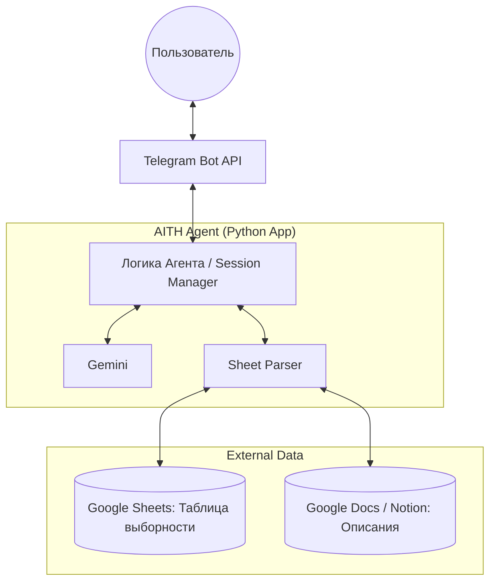
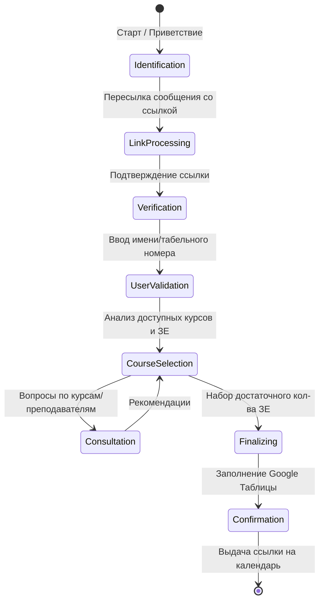

# AITH Agent: Ваш университетский помощник по курсам по выбору
Интеллектуальный Telegram-бот на базе Gemini, предназначенный для автоматизации процесса выбора учебных дисциплин. Бот анализирует таблицы выборности, верифицирует данные пользователя и помогает составить индивидуальное расписание.

## Основные функции
* Персонализация: Уникальные сессии для каждого пользователя.
* Интеграция с Google Sheets: Парсинг таблиц курсов и запись результатов выбора.
* Интеллектуальный поиск: Извлечение ссылок, имен преподавателей и описаний курсов из документов (Google Docs/Notion).
* Рекомендательная система: Подбор курсов на основе запросов пользователя.
* Контроль лимитов: Автоматический подсчет зачетных единиц (ЗЕ) с учетом обязательных предметов.

## Технологический стек
LLM Engine: Gemini API

Framework: aiogram (Telegram Bot API)

External APIs: Google Sheets API

+ Google Calendar integration

## Визуализация агента

## Юзерский путь

